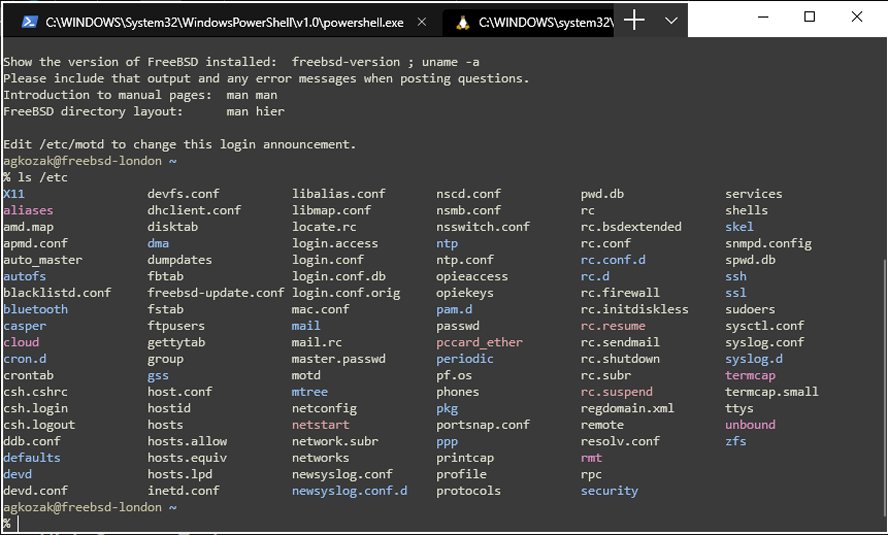
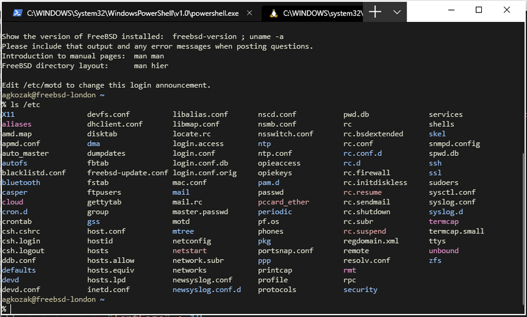

# Zenburn Color Schemes for [Windows Terminal](https://github.com/microsoft/terminal)

[](https://opensource.org/licenses/MIT)
[](https://github.com/agkozak/windows-terminal-zenburn/stargazers)

## Zenburn



## High-Contrast Zenburn



## Installation

The following instructions are up to date as of Windows Terminal v1.15.2875.0.

In Windows Terminal, open Settings (`Ctrl+,`) and click on "Open JSON file." That should allow you to edit your `settings.json`. Edit the `schemes` array to include the Zenburn and High-Contrast Zenburn color schemes:

```json
"schemes": [
    {
        "background" : "#3A3A3A",
        "black" : "#1E2320",
        "blue" : "#506070",
        "brightBlack" : "#709080",
        "brightBlue" : "#94BFF3",
        "brightCyan" : "#93E0E3",
        "brightGreen" : "#C3BF9F",
        "brightPurple" : "#EC93D3",
        "brightRed" : "#DCA3A3",
        "brightWhite" : "#FFFFFF",
        "brightYellow" : "#F0DFAF",
        "cyan" : "#8CD0D3",
        "foreground" : "#DCDCCC",
        "green" : "#60B48A",
        "name" : "Zenburn",
        "purple" : "#DC8CC3",
        "red" : "#D78787",
        "white" : "#DCDCCC",
        "yellow" : "#DFAF8F"
    },
    {
        "background" : "#1C1C1C",
        "black" : "#1E2320",
        "blue" : "#506070",
        "brightBlack" : "#709080",
        "brightBlue" : "#94BFF3",
        "brightCyan" : "#93E0E3",
        "brightGreen" : "#C3BF9F",
        "brightPurple" : "#EC93D3",
        "brightRed" : "#DCA3A3",
        "brightWhite" : "#FFFFFF",
        "brightYellow" : "#F0DFAF",
        "cyan" : "#8CD0D3",
        "foreground" : "#DCDCCC",
        "green" : "#60B48A",
        "name" : "High-Contrast Zenburn",
        "purple" : "#DC8CC3",
        "red" : "#D78787",
        "white" : "#DCDCCC",
        "yellow" : "#DFAF8F"
    }
],
```

Now all you need to do is to pick a Windows Terminal profile to apply a Zenburn color scheme to. In `settings.json`, find the section that starts with `"profiles" :`. Scroll down, looking at the `"name"` of each profile until you find the one you want.  Now you need to specify its color scheme, thus:

```json
{
    "guid": "{2c4de342-38b7-51cf-b940-2309a097f518}",
    "hidden": false,
    "name": "Ubuntu",
    "source": "Windows.Terminal.Wsl",
    "colorScheme" : "High-Contrast Zenburn",
    "icon" : "C:/Users/agkoz/TerminalIcons/ubuntu-icon.png"
},
```
Use `"colorScheme" : "Zenburn"` for Zenburn, or `"colorScheme" : "High-Contrast Zenburn"` for High-Contrast Zenburn.

Save `settings.json`; the changes should apply immediately.
